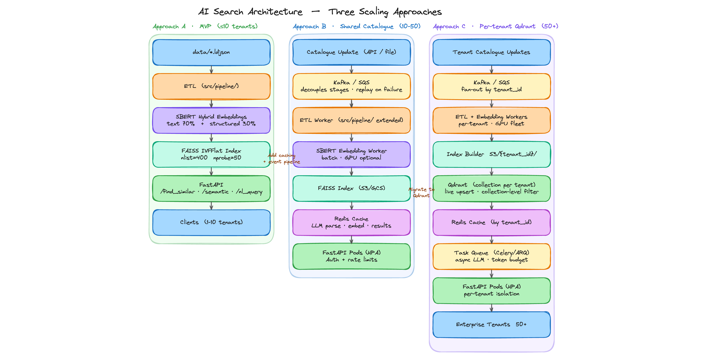
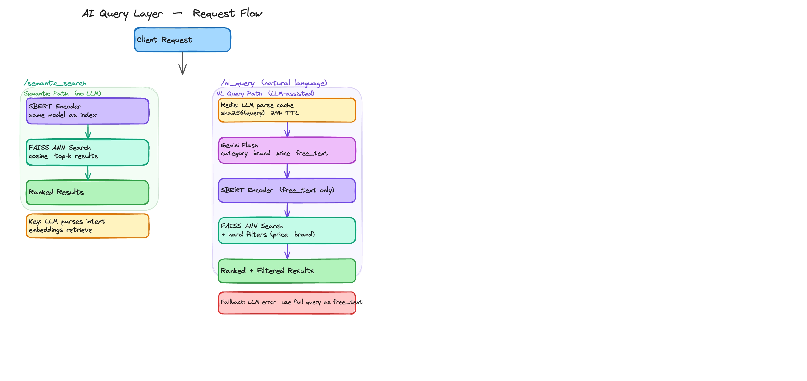
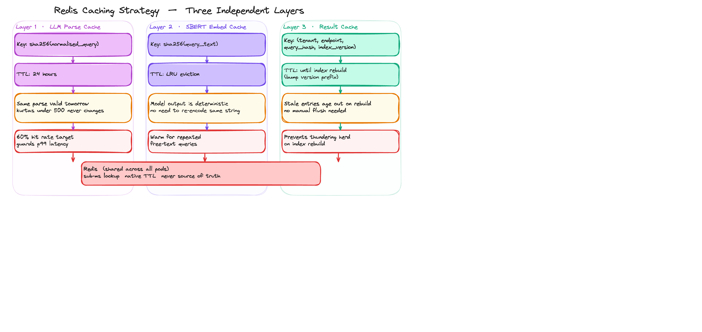
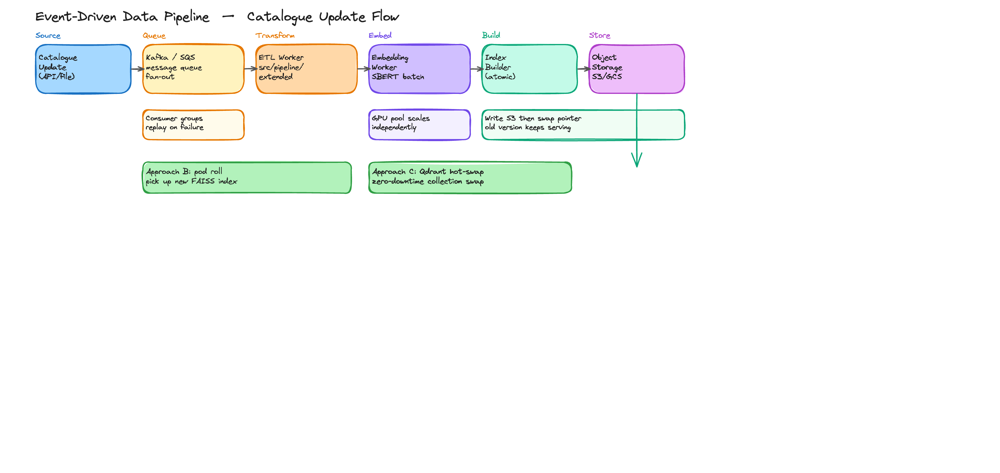
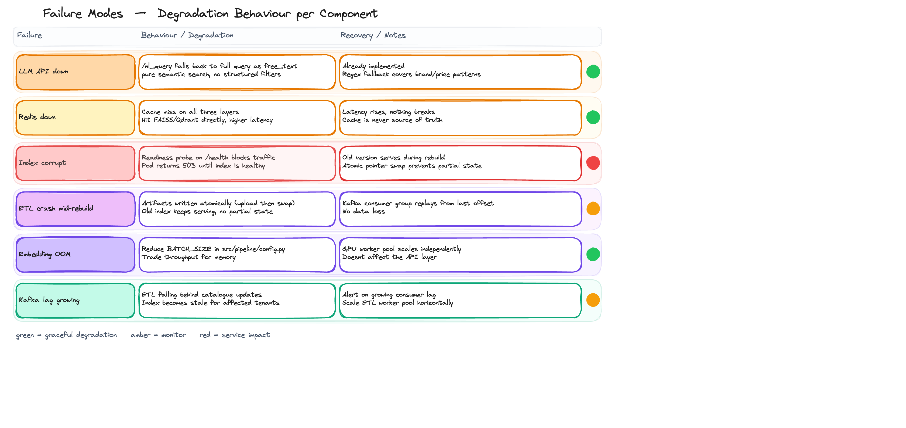

# Architecture — AI-Augmented Similarity Search

**What's running today:** ETL pipeline → SBERT hybrid embeddings → FAISS ANN index → FastAPI.
This document covers the current system in detail and maps three scaling approaches — MVP,
shared-catalogue, and per-tenant — each optimised for a different multi-tenancy model.

---

## Overview diagram



*Three-column architecture: Approach A (MVP ≤10 tenants) → Approach B (Shared Catalogue 10–50) → Approach C (Per-tenant Qdrant 50+). Amber arrows show the migration path between approaches.*

---

## 1 · System as built (Approach A — MVP)

```
data/*.ldjson
  └─ ETL (src/pipeline/)
       ├─ products_clean.parquet
       ├─ hybrid_vectors.npy       ← SBERT text 70 % + structured 30 %
       └─ faiss.index              ← IVFFlat, nlist=400, nprobe=50
            └─ FastAPI (uvicorn)
                 ├─ GET /find_similar_products  → List[uniq_id]
                 ├─ GET /semantic_search        → free-text → ranked results
                 └─ POST /nl_query              → LLM-parsed filters + search
```

Vectors are L2-normalised so cosine similarity reduces to a dot product. FAISS runs as a
separate process from embedding because `torch` and `faiss` both link `libomp` and segfault if
they share a process on macOS.

**Suitable for:** single business, ≤ 10 customers, static or infrequently updated catalogue.

---

## 2 · AI query layer



*Two request paths on the same vector index: `/semantic_search` (SBERT → FAISS, no LLM) and `/nl_query` (Redis cache check → Gemini Flash parse → SBERT → FAISS + hard filters). LLM timeout falls back gracefully to pure semantic search.*

Two query surfaces sit on top of the same vector index:

| Endpoint | How it works | LLM involved? |
|---|---|---|
| `/semantic_search` | SBERT-encodes free text, cosine-searches the catalogue | No |
| `/nl_query` | Gemini Flash parses `"cotton kurtas under ₹500 by BIBA"` → `{category, brand, colour, min_price, max_price, free_text}`, SBERT retrieves, hard filters narrow | Yes |

**Design decisions:**

- **LLM parses, embeddings retrieve.** The LLM is kept out of the retrieval path — the expensive
  step is cached and skippable.
- **Structured filters are hard constraints, not ranking signals.** Treating price and brand as
  ranking signals lets violations sneak into top results.
- **Graceful degradation.** No API key or timeout → treat full query as `free_text`, never 500.

---

## 3 · Approaches at production scale

The critical fork: **do tenants share a catalogue or bring their own?** That single question
determines almost everything about the architecture.

```
                    ┌─ shared catalogue ───────────────► Approach B
Customer data owns? │
                    └─ own catalogue per tenant ────────► Approach C
```

---

### Approach A — Single shared index (MVP, ≤ 10 tenants)

**What changes from the current system:** add auth middleware + rate limits. Nothing else.

```
Client (Tenant 1..N)
  └─ API Gateway (JWT / API-key validation, per-tenant rate limit)
       └─ FastAPI pods  ←─── single FAISS index (read-only, baked into image)
            └─ Redis (LRU: SBERT embed cache + result cache)
```

**Sizing:** at 10 tenants × 10 req/s = 100 req/s, a single FastAPI pod handles this with room
to spare. The index is read-only so replicas share the same baked image with no coordination.

**Bottleneck:** the LLM path. 10 concurrent LLM calls at ~1 s each saturates a small fleet;
add per-tenant token budgets before you hit this.

**When to move on:** index staleness (no live updates), or catalogue diverges per customer.

---

### Approach B — Shared catalogue, multi-tenant serving (10–50 tenants)

All customers query **one** physical index. Auth middleware enforces isolation at the API layer.

```
Catalogue update
  └─ ETL worker (extends src/pipeline/)
       └─ Embedding worker (SBERT batch)
            └─ faiss.index (object storage: S3/GCS)
                 └─ FastAPI pods (HPA on CPU)
                      ├─ Redis  { LLM-parse cache (24 h TTL)
                      │         { SBERT-embed cache (LRU)
                      │         { result cache (tenant+query+index-version key)
                      └─ Auth middleware (API key → tenant_id → rate limit)
```

**At 50 tenants × 100 req/s peak ≈ 5 000 req/s:** FAISS at 0.24 ms/query handles this on
2–3 stateless pods. HPA on CPU keeps the fleet right-sized.

**Caching strategy** (three separate layers):




| Cache | Key | TTL | Why separate |
|---|---|---|---|
| LLM parse result | `sha256(normalised_query)` | 24 h | Same parse is valid across days |
| SBERT embedding | `sha256(query_text)` | LRU evict | Model output is deterministic |
| Result list | `(tenant, endpoint, query_hash, index_version)` | Until rebuild | Bump `index_version` prefix → stale entries age out; no manual flush on rebuild |

**When to move on:** tenants bring their own product data, or enterprise contracts require
physical data isolation.

---

### Approach C — Per-tenant isolated catalogues (50+ tenants, enterprise)

Each customer ingests their own catalogue. Data is physically isolated per tenant.

```
Tenant catalogue update (API / file upload)
  └─ Message queue (Kafka or SQS)
       ├─ ETL worker          (extends src/pipeline/; fan-out per tenant_id)
       └─ Embedding worker    (SBERT batch; GPU worker pool)
            └─ Index builder  → object storage (S3: artifacts/{tenant_id}/faiss.index)
                 └─ Qdrant (self-hosted)
                      ├─ Collection per tenant  ← live updates, zero-downtime swap
                      ├─ Collection-level filtering (no post-filter step needed)
                      └─ FastAPI pods
                           ├─ Redis cache (keyed by tenant_id prefix)
                           ├─ Per-tenant token budget + async LLM client
                           └─ Task queue (Celery / ARQ) for burst absorption
```

**Why Qdrant over FAISS at this scale:**

| | FAISS in-process | Qdrant self-hosted |
|---|---|---|
| Live updates | Full rebuild required | Upsert in place |
| Multi-tenant isolation | Manual artifact management | Collection per tenant |
| Filtering | Post-filter step | Index-level, no recall loss |
| Zero-downtime rebuild | Pointer swap (fragile) | Native collection swap |
| GPU support | Yes | Roadmap |

Pinecone is fully managed but vendor lock-in and cost don't justify it vs self-hosted Qdrant at
this scale. Weaviate is the next alternative if GraphQL query interface is needed.

**Pod memory at 50 tenants:** if each Qdrant collection is ~1 GB, keeping all in memory costs
50 GB. LRU eviction is necessary; pre-warm the hottest tenants during off-peak hours.

---

## 4 · Decision summary

| Criterion | Approach A | Approach B | Approach C |
|---|---|---|---|
| Tenants | 1–10 | 10–50 | 50+ |
| Catalogue ownership | Shared | Shared | Per-tenant |
| Index technology | FAISS (file) | FAISS (object store) | Qdrant (collection) |
| Live catalogue updates | No | Batch rebuild | Yes (upsert) |
| Data isolation | API-layer only | API-layer only | Physical (per collection) |
| LLM integration | Inline | Cached + rate-limited | Async + task queue |
| Operational complexity | Low | Medium | High |
| Monthly infra cost (rough) | < $200 | $500–2 000 | $2 000–10 000 |

**Migration path:** A → B is adding caching + an event-driven rebuild pipeline (no data model
change). B → C requires migrating index storage to Qdrant collections — a one-time migration per
tenant, not a rewrite.

---

## 5 · Data pipeline at scale



*Horizontal pipeline: Source → Kafka/SQS (decoupled, replay-able) → ETL Worker → Embedding Worker (GPU pool) → Index Builder (atomic S3 write) → API pods pick up new version via pod roll (Approach B) or Qdrant hot-swap (Approach C).*


**Today:** flat file → pandas ETL → parquet → numpy vectors → FAISS.
Works for a single static dump.

**At Approach B/C:** catalogue updates must flow continuously without manual runs.

```
catalogue update (API / file upload)
  → Kafka / SQS                    ← decouples stages; enables replay on failure
  → ETL worker                     ← extends current src/pipeline/
  → Embedding worker               ← SBERT batch encode; GPU if available
  → Index builder                  → object storage (atomic upload then pointer swap)
  → API pods pick up new version   ← pod roll (B) or Qdrant hot-swap (C)
```

Kafka decouples stages so each scales independently. Embedding is the slow step and benefits
most from its own worker pool. Consumer groups give you replay on crash — important when an index
build crashes halfway through.

**Artifact atomicity:** write to object storage, then swap the pointer. The old version keeps
serving until the new one is ready. No partial-index state ever reaches production.

---

## 6 · Failure modes



*Six failure scenarios with degradation behaviour and recovery notes. Colour-coded severity: green = graceful degradation, amber = monitor, red = service impact.*


| Failure | Behaviour |
|---|---|
| LLM API down | `/nl_query` falls back to treating full query as `free_text` (pure semantic search). Already implemented. |
| Index corrupt / missing | 503 with a clear error. Readiness probe on `/health` prevents traffic reaching an unready pod. |
| Redis down | Cache miss → hit FAISS/Qdrant directly. Latency up, nothing broken. Cache is never source of truth. |
| ETL worker crashes mid-rebuild | Old index keeps serving (atomic pointer swap). No partial state in production. |
| Embedding model OOM | Reduce `batch_size` in `src/pipeline/embed.py` (hardcoded 256) to trade throughput for memory. |

---

## 7 · Latency targets

| Endpoint | p50 | p99 |
|---|---|---|
| `/find_similar_products` | < 20 ms | < 100 ms |
| `/semantic_search` | < 60 ms | < 200 ms |
| `/nl_query` (with LLM) | < 500 ms | < 2 s |

At p99 the LLM call dominates. If the LLM cache hit rate drops below ~60 %, the p99 target
becomes hard to hit — that is the metric to watch in production.

---

## 8 · Observability

Minimum viable instrumentation from day one:

| Signal | What to watch | Alert threshold |
|---|---|---|
| Request tracing | One trace per request: input → LLM parse → SBERT encode → FAISS/Qdrant → post-filter | p99 > 300 ms sustained |
| LLM cost per tenant | Token usage + cost/day per tenant_id | Unusual spike vs 7-day baseline |
| Cache hit rate | LLM parse cache and result cache separately | Drop below 60 % (p99 will follow) |
| Index staleness | Time since last successful rebuild per tenant | > configured rebuild interval |
| LLM error rate | Fallback rate on `/nl_query` | > 5 % (fallback fires, but you want early warning) |
| Kafka consumer lag | ETL falling behind catalogue updates | Growing monotonically |

**Without request tracing,** "the NL query is slow" is unfalsifiable — you won't know whether
latency is in the LLM call, the embedding, or FAISS.

---

## 9 · Key design decisions

**FAISS IVFFlat over HNSW/Annoy**
IVFFlat has a clean upgrade path to IVF+PQ when vectors don't fit in RAM (compress ~8× with
minimal recall loss) and runs on GPU. HNSW has better recall/speed at small scale but the graph
structure doesn't compress and has no GPU path. At 30 k products the difference is negligible;
the upgrade path to larger catalogues favoured FAISS.

**SBERT over TF-IDF**
Benchmarked both on label proxies (category + brand match @ k=10, 500 queries) — they tie,
because `text_blob` contains brand and category names verbatim. SBERT's real advantage is on
cases the benchmark can't measure: synonym matching, transliterated Hindi, typos, paraphrase
variants. That is what production query text looks like.

**Hybrid vector (text + structured) over text-only**
Pure text embeddings rank a ₹200 saree and a ₹5 000 saree identically if descriptions match.
The 30 % structured block (price, rating, discount, prime, rank) keeps results in the same
rough product tier without making price a hard filter.

**LLM for NL parsing, not retrieval**
The LLM only extracts structured intent from the query. Retrieval and ranking stay with the
vector index. This keeps retrieval fast, deterministic, and cheap — and the LLM step is fully
cacheable and gracefully degradable.

---

## 10 · Domain-specific embeddings

`all-MiniLM-L6-v2` works well for general e-commerce. For enterprise verticals with
domain-specific vocabulary, a domain model typically adds 15–30 % retrieval quality because
the general model doesn't know that "MI" means myocardial infarction, not Michigan.

| Vertical | Model | Why |
|---|---|---|
| Fashion (multimodal) | FashionCLIP (`patrickjohncyh/fashion-clip`) | Text + image similarity — natural next step here |
| Healthcare | PubMedBERT (`microsoft/BiomedNLP-BiomedBERT-base`) | Medical device catalogues, pharma matching |
| Legal | LegalBERT (`nlpaueb/legal-bert-base-uncased`) | Contract clause matching, regulatory search |
| Finance | FinBERT (`ProsusAI/finbert`) | Financial product search with sentiment awareness |
| Manufacturing | MaterialsBERT (`pranav-s/MaterialsBERT`) | Material spec search, part deduplication |
| Multilingual | `paraphrase-multilingual-mpnet-base-v2` | Multi-language catalogues |

Swapping the model is one line in `src/pipeline/config.py` (`SBERT_MODEL`). The FAISS index,
API, and similarity logic are embedding-agnostic — you just rebuild the vectors and index. The
only catch is that different models output different vector dimensions (384–768), so switching
requires a full index rebuild.
